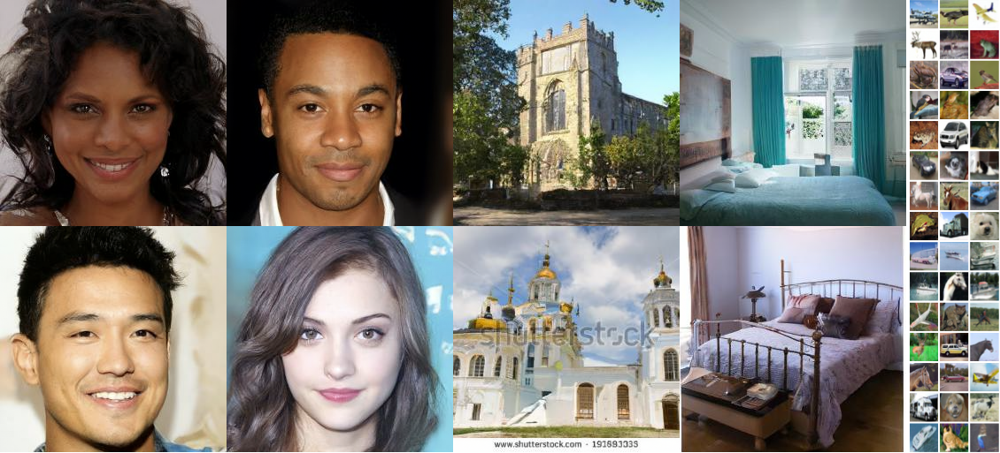

# Denoising Diffusion Probabilistic Models

Jonathan Ho, Ajay Jain, Pieter Abbeel

Paper: https://arxiv.org/abs/2006.11239

Website: https://hojonathanho.github.io/diffusion



Experiments run on Google Cloud TPU v3-8.
Requires TensorFlow 1.15 and Python 3.5, and these dependencies for CPU instances (see `requirements.txt`):
```
pip3 install fire
pip3 install scipy
pip3 install pillow
pip3 install tensorflow-probability==0.8
pip3 install tensorflow-gan==0.0.0.dev0
pip3 install tensorflow-datasets==2.1.0
```

The training and evaluation scripts are in the `scripts/` subdirectory.
The commands to run training and evaluation are in comments at the top of the scripts.
Data is stored in GCS buckets. The scripts are written to assume that the bucket names are of the form `gs://mybucketprefix-us-central1`; i.e. some prefix followed by the region.
The prefix should be passed into the scripts using the `--bucket_name_prefix` flag.

Models and samples can be found at: https://www.dropbox.com/sh/pm6tn31da21yrx4/AABWKZnBzIROmDjGxpB6vn6Ja

## Torch: Conditional b-space DDPM (SVD residual)

This repo also contains a minimal PyTorch prototype that implements the idea:

- Build a low-rank conditional image $I_L$ by truncating singular values of $I_H$
- Define residual in SVD basis of $I_L$: $b = U_L^T (I_H - I_L)$
- Train a conditional DDPM in b-space to sample $b$ from Gaussian noise
- Reconstruct: $I_{out} = I_L + U_L b$

Run:

```bash
python3 diffusion_torch/diffusion_torch/train_b_diffusion.py \
    --epochs 200 --batch 64 --k_truncate 16 --timesteps 1000 --save_every 10
```

Output preview image defaults to `b_diffusion_recon.jpg` (original | low-rank | reconstructed).

## Torch: Two-stage unconditional generation + FID (CIFAR10)

To get fully unconditional sampling while keeping the SVD residual idea:

1) Train an unconditional DDPM to generate low-rank images $I_L$.
2) Train a conditional DDPM in b-space to sample $b \sim p(b\mid I_L)$.
3) Sample with DDIM for speed and compute FID.

Train stage-1 ($I_L$ model):

```bash
python3 diffusion_torch/diffusion_torch/train_il_diffusion.py \
    --epochs 200 --batch 128 --k_truncate 16 \
    --timesteps 1000 --beta_schedule cosine \
    --sample_steps 50 --save_every 10 --ckpt il_ddpm_ckpt.pt
```

Train stage-2 (b-space conditional model):

```bash
python3 diffusion_torch/diffusion_torch/train_b_diffusion.py \
    --epochs 200 --batch 64 --k_truncate 16 \
    --timesteps 1000 --beta_schedule cosine \
    --sample_steps 50 --save_every 10 --ckpt b_ddpm_ckpt.pt
```

Unconditional two-stage sampling (noise -> $I_L$ -> $b$ -> $I_{out}$):

```bash
python3 diffusion_torch/diffusion_torch/two_stage_sample.py \
    --il_ckpt il_ddpm_ckpt.pt --b_ckpt b_ddpm_ckpt.pt \
    --n 64 --sample_steps 50 --out two_stage_samples.jpg
```

FID on CIFAR10 using torchvision Inception features (caches real activations):

```bash
python3 diffusion_torch/diffusion_torch/eval_fid_two_stage.py \
    --il_ckpt il_ddpm_ckpt.pt --b_ckpt b_ddpm_ckpt.pt \
    --num 10000 --sample_steps 50 --real_split train
```

## Citation
If you find our work relevant to your research, please cite:
```
@article{ho2020denoising,
    title={Denoising Diffusion Probabilistic Models},
    author={Jonathan Ho and Ajay Jain and Pieter Abbeel},
    year={2020},
    journal={arXiv preprint arxiv:2006.11239}
}
```
